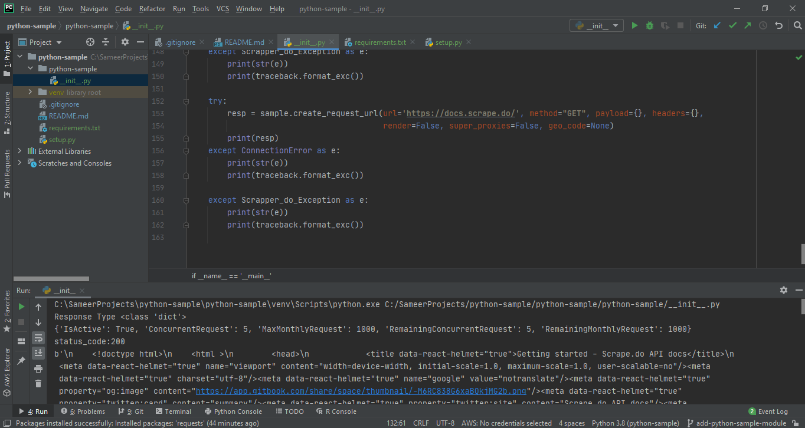

# python-sample

    

Web Scraper Api
 - Best Rotating Proxy & [Scraping API](https://scrape.do/) Alternative.
 - :warning: Please read the [documents](https://docs.scrape.do/) first.
 
 #### You can send request to any webpages with proxy gateway & web api provided by scrape.do. As you can see from the example, this takes only few lines of code
 
 #### You can see Example here ([test.py](/test.py))
 
 ## Usage
 
 first you need to create python_sample as [python-sample](/python_sample_scrape_do/__init__.py)
 
 and use python_sample class to handle scrape.do api's
    
    from python_sample_scrape_do import Scrape_do_Exception, python_sample
    
    API_TOKEN = "Your_API_TOKEN_FOR_scrape.do"
    
    # create an python-sample object
    sample = python_sample()
    
    # set the scrape.do api key
    sample.set_api_token(api_token=API_TOKEN)
    
    # Get Scrape.do account statistics
    try:
        resp = sample.account_status()
        print("Response Type " + str(type(resp)))
        print(resp)
    except ConnectionError as e:
        print(str(e))
        print(traceback.format_exc())
    
    except Scrape_do_Exception as e:
        print(str(e))
        print(traceback.format_exc())
    
    try:
        resp = sample.create_request_url(url='https://docs.scrape.do/', method="GET", payload={}, headers={},
                                         render=False, super_proxies=False, geo_code=None)
        print(resp)
    except ConnectionError as e:
        print(str(e))
        print(traceback.format_exc())
    
    except Scrape_do_Exception as e:
        print(str(e))
        print(traceback.format_exc())

## Author

  [Batuhan Özyön](https://github.com/bynf)  
  [Sameer Narkhede](https://github.com/narkhedesam)
  
      
### Screenshot
 

  

